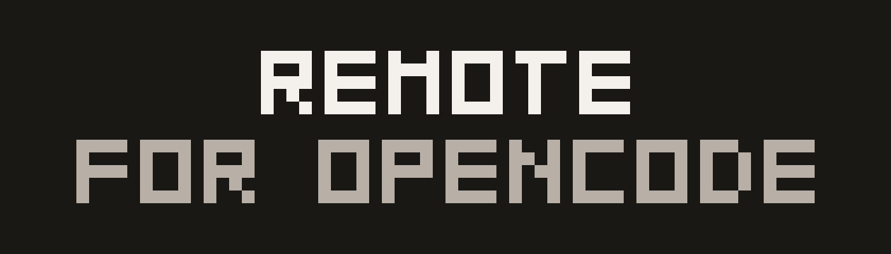

<p align="center">
  
</p>

# Remote for OpenCode

Drive the [OpenCode](https://opencode.ai) coding agent on your Mac from a
native iPhone app — with **zero network configuration**. No Tailscale, no
VPS, no port forwarding, no IP addresses to type. Your Mac writes the code;
your phone holds the leash.

> **Status: early access.** The Mac companion (1.1) ships today via
> Homebrew and direct download; the iPhone app is on its way to the App
> Store. Pairing, session browsing, prompting, streaming, and tool
> approvals work on your LAN now; remote (hole-punched) access and push
> notifications are in active development.

*Remote for OpenCode is an independent project, not affiliated with or
endorsed by the OpenCode project or Anomaly. It drives your own OpenCode
installation.*

## The promise

- **No networking homework.** Your devices find each other through your
  own iCloud account and talk directly. Nothing to configure, nothing to
  subscribe to.
- **No servers, including ours.** Traffic is end-to-end encrypted between
  your two devices (Curve25519 pairing, ChaCha20-Poly1305 sealing). There
  is nothing in the middle, because there is nothing to be in the middle.
- **Approvals that vary with risk.** A `git status` and an `rm -rf` should
  not look the same. Destructive commands get a louder card and no blanket
  allow — you see the exact command, then Allow Once / Always / Reject.
- **Plan mode.** Switch the agent to Plan and it cannot edit anything at
  all. Explore and get a plan back, guaranteed nothing changed.
- **Review before you sign off.** Every accumulated change, per file, line
  by line, against your last commit or your default branch — the way a
  reviewer would see it.
- **Answers outlive the socket.** iOS drops connections when you switch
  apps; the turn keeps running on the Mac, and the phone resumes the
  stream where it left off.
- **Your credentials stay put.** The agent uses the model providers you
  configured on your Mac. Their keys never leave it and the phone never
  sees them.

## How it works

```
iPhone (native SwiftUI)
   │  end-to-end encrypted (ChaChaPoly; Curve25519 pairing)
   │  Bonjour TCP on your LAN · hole-punched UDP from anywhere
   ▼
Mac menu-bar companion
   │  owns `opencode serve`, bound to localhost only
   ▼
OpenCode — your projects, your git, your model credentials. All on your Mac.
```

The OpenCode server never touches the network: it listens on localhost,
the companion is the only gateway, and every connection is authenticated
and encrypted before a byte of protocol flows. Pairing exchanges public
keys through *your own* iCloud private database and confirms a six-digit
code shown on both screens — pairing, not accounts.

## Getting started

You need a Mac running macOS 14 Sonoma or later, an iPhone on iOS 17 or
later, [OpenCode](https://opencode.ai) installed on the Mac, and both
devices signed into the same iCloud account — that last part is how they
find each other without you configuring anything.

### 1. Install the Mac companion

Homebrew is the easiest route — it keeps itself up to date afterwards
(via Sparkle, so `brew upgrade` stays out of the way):

```sh
brew install --cask tjameswilliams/tap/remote-for-opencode
```

Or [download the dmg](https://remoteforopencode.com/downloads/RemoteForOpenCode.dmg)
directly — signed and notarized. The companion lives in your menu bar; it
will tell you if it can't find OpenCode.

### 2. Install the iPhone app

Coming to the App Store as **Remote for OpenCode Agents**. Until it
lands, build it from source (below) and run it on your own device.

### 3. Pair them

1. Open the companion on your Mac and choose **Pair iPhone…**
2. Open the app on your iPhone.
3. Confirm both screens show the same six-digit code.

iOS will ask for Local Network permission the first time — that is the
phone talking to your Mac, and nothing else. If pairing can't find the
Mac, check both devices are on the same network and iCloud account.

### 4. Your first session

Pick a repository, type (or dictate) a prompt, and watch the turn happen:
the agent's reasoning, each tool call, and the streamed answer. When it
wants to run a command you get an approval card sized to the risk; when
it edits files you get a per-file diff to read before you say the word.
Attach a photo — a whiteboard, an error on another screen — and it goes
to your Mac and nowhere else. Slash commands, model switching, and Plan
mode work from the composer, same as at your desk.

When you background the app, the agent keeps working. Come back and the
turn picks up where it left off.

### Away from your LAN

Hole-punched UDP (work from anywhere, still peer-to-peer) and push
notifications (approve from the lock screen) are in active development —
the wire protocol, NAT traversal, and CloudKit attention records are all
in this repository today, working toward device-verified releases.

## Building from source

```sh
brew install xcodegen opencode
cd app && xcodegen generate && open RemoteForOpenCode.xcodeproj
```

Run the **MacCompanion** target on your Mac and the **Phone** target on
your iPhone, then pair as above. The shared package has its own tests:

```sh
cd packages/RemoteKit && swift test
```

`tools/uiharness` renders the phone's real views against canned content in
the simulator — design iteration and App Store screenshots without a
paired Mac.

## Repository layout

| Path | What |
|---|---|
| `packages/RemoteKit/` | Shared Swift package: transport, pairing, protocol v1, policy — unit-tested (`swift test`) |
| `app/MacCompanion/` | Menu-bar app: OpenCode lifecycle, version-skew adapter, Wire server |
| `app/Phone/` | SwiftUI iPhone app |
| `docs/protocol-v1.md` | The phone⇄Mac contract, with the verified OpenCode mapping behind it |
| `tools/mark/` | Generates the icon, favicon, and this README's banner from the shared glyph grid |
| `tools/uiharness/` | Renders the real phone views in the simulator without a paired Mac |
| `spikes/` | Throwaway validation scripts |

The transport and pairing stack is shared with (and battle-tested in)
[Tomte](https://tomteapp.com), the author's local-AI assistant for Mac + iPhone.

## Privacy

Remote for OpenCode collects nothing. No accounts, no analytics, no
telemetry, no third-party SDKs; the only network destinations are your
own Mac and your own iCloud. The full policy is at
[remoteforopencode.com/privacy](https://remoteforopencode.com/privacy)
and in [docs/privacy.md](docs/privacy.md) — short enough to actually read.

## License

[PolyForm Noncommercial 1.0.0](LICENSE.md) — use it, read it, change it,
share it, for any noncommercial purpose. Commercial use requires a separate
license; open an issue if that's you. Third-party notices are in
[NOTICE.md](NOTICE.md).
